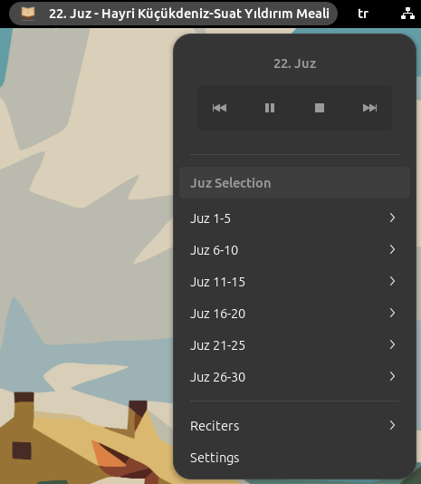
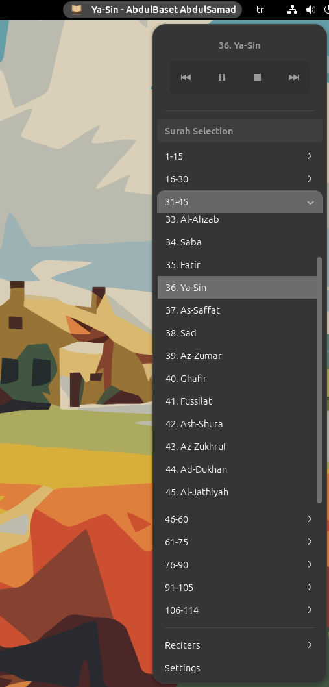
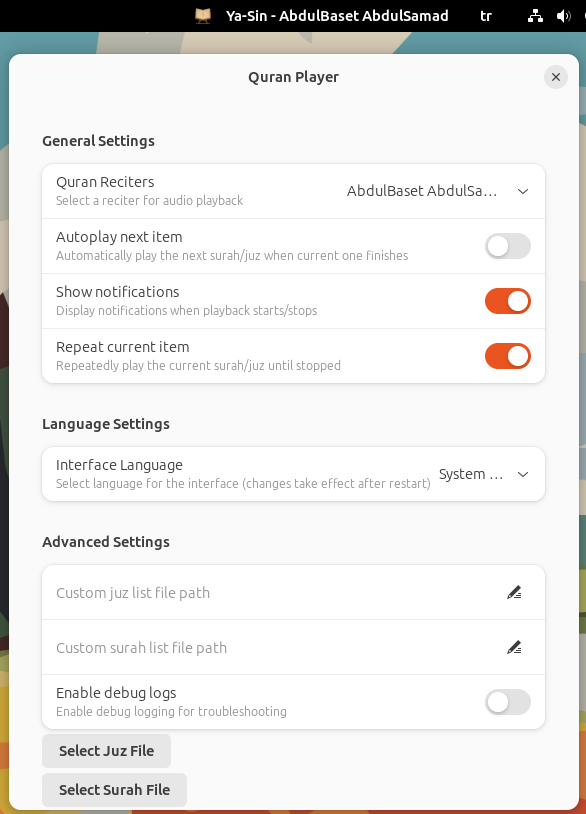

# Quran Player GNOME Shell Extension

**Author:** [faymaz](https://github.com/faymaz)







## English

A GNOME Shell extension that lets you listen to Quran recitations directly from your desktop.

### Features

- Full list of all 114 Quran surahs organized in groups
- Multiple reciter options including Mustafa Ismail and Abdulbasit Abdussamed
- English and German translation options available
- Playback controls (play/pause, next, previous, stop)
- Resume from exact position after pausing
- Customizable settings
- Notifications for playback status
- Support for custom reciter lists
- Multiple language interfaces (English, Turkish, German, Arabic)
- Juz (section) based playback support

### Requirements

- GNOME Shell 45 or newer
- glib-compile-schemas (part of glib2.0-dev package)

### Installation

You can install the extension in two ways:

#### From GNOME Extensions Website

1. Visit [Quran Player on GNOME Extensions](https://extensions.gnome.org/extension/7991/quran-player/)
2. Toggle the switch to ON to install the extension
3. Follow any additional prompts to complete installation

#### Manual Installation from GitHub

1. Clone or download this repository
2. Copy all files to the extension directory:
   ```bash
   mkdir -p ~/.local/share/gnome-shell/extensions/quran-player@faymaz.github.com
   cp -r * ~/.local/share/gnome-shell/extensions/quran-player@faymaz.github.com/
   ```
3. Create and compile the schema:
   ```bash
   cd ~/.local/share/gnome-shell/extensions/quran-player@faymaz.github.com/schemas
   glib-compile-schemas .
   ```
4. Restart GNOME Shell:
   - On X11: Press Alt+F2, type 'r', and press Enter
   - On Wayland: Log out and log back in
5. Enable the extension:
   ```bash
   gnome-extensions enable quran-player@faymaz.github.com
   ```

### Usage

After installation, you'll see a Quran icon in the GNOME top bar. Click it to open the Quran Player menu.

#### Main Features

- Browse surahs by group (organized in sets of 15) or browse juz (sections)
- Click on any surah or juz to start playback
- Use the player controls to:
  - Play/Pause (continues from the same position when paused)
  - Stop
  - Skip to previous surah/juz
  - Skip to next surah/juz
- Select different reciters from the Reciters submenu
- Access settings from the menu

#### Settings

Access the extension settings by:
- Clicking "Settings" in the extension menu
- Or using GNOME Extensions app and clicking the gear icon next to the extension

In the settings panel, you can:
- Select your preferred reciter
- Toggle autoplay for the next surah/juz
- Enable/disable notifications
- Set a custom surah or juz list file
- Change interface language
- Enable debug logging for troubleshooting

### Customization

#### Custom Reciters

You can edit the `custom-reciters.json` file to add or modify reciters. The format is:

```json
[
  {
    "name": "Reciter Name",
    "baseUrl": "https://example.com/path/to/audio/",
    "audioFormat": "%id%.mp3",
    "type": "surah"
  },
  {
    "name": "Reciter with Special Format",
    "baseUrl": "https://example.com/path/to/audio/",
    "audioFormat": "%specialFormat%",
    "type": "surah",
    "hasSpecialFormat": true,
    "formatMap": {
      "01": "special-format-file-001.mp3",
      "02": "special-format-file-002.mp3"
    }
  }
]
```

The `audioFormat` field supports these placeholders:
- `%id%`: 3-digit surah number (001, 002, etc.)
- `%audioId%`: The audioId from surahs.json
- `%name%`: Surah name

### Troubleshooting

If the extension doesn't work:

1. Make sure you're using GNOME Shell 45 or newer
2. Check for errors in Looking Glass (Alt+F2, type 'lg')
3. Make sure the schema file is correctly compiled
4. Verify that `~/.local/share/gnome-shell/extensions/quran-player@faymaz.github.com/schemas/` contains `gschemas.compiled`
5. Enable debug logging in the extension settings and check the logs

### Contributing

Suggestions, bug reports, and pull requests are welcome on GitHub!

---

## Türkçe

Masaüstünüzden doğrudan Kur'an-ı Kerim tilavetlerini dinlemenizi sağlayan bir GNOME Shell uzantısı.

### Özellikler

- Gruplar halinde düzenlenmiş tüm 114 Kur'an suresinin tam listesi
- Mustafa İsmail ve Abdulbasit Abdussamed dahil birçok kari seçeneği
- İngilizce ve Almanca meal seçenekleri mevcut
- Oynatma kontrolleri (oynat/duraklat, sonraki, önceki, durdur)
- Duraklatıldıktan sonra tam kaldığı yerden devam etme
- Özelleştirilebilir ayarlar
- Oynatma durumu bildirimleri
- Özel kari listesi desteği
- Çoklu dil arayüzü (İngilizce, Türkçe, Almanca, Arapça)
- Cüz bazlı oynatma desteği

### Gereksinimler

- GNOME Shell 45 veya daha yeni
- glib-compile-schemas (glib2.0-dev paketinin bir parçası)

### Kurulum

Uzantıyı iki şekilde kurabilirsiniz:

#### GNOME Uzantılar Web Sitesinden

1. [GNOME Uzantılar'daki Quran Player](https://extensions.gnome.org/extension/7991/quran-player/) sayfasını ziyaret edin
2. Uzantıyı kurmak için anahtarı AÇIK konumuna getirin
3. Kurulumu tamamlamak için ek yönergeleri izleyin

#### GitHub'dan Manuel Kurulum

1. Bu depoyu klonlayın veya indirin
2. Tüm dosyaları uzantı dizinine kopyalayın:
   ```bash
   mkdir -p ~/.local/share/gnome-shell/extensions/quran-player@faymaz.github.com
   cp -r * ~/.local/share/gnome-shell/extensions/quran-player@faymaz.github.com/
   ```
3. Şemayı oluşturun ve derleyin:
   ```bash
   cd ~/.local/share/gnome-shell/extensions/quran-player@faymaz.github.com/schemas
   glib-compile-schemas .
   ```
4. GNOME Shell'i yeniden başlatın:
   - X11'de: Alt+F2 tuşlarına basın, 'r' yazın ve Enter'a basın
   - Wayland'da: Oturumu kapatıp tekrar açın
5. Uzantıyı etkinleştirin:
   ```bash
   gnome-extensions enable quran-player@faymaz.github.com
   ```

### Kullanım

Kurulumdan sonra, GNOME üst çubuğunda bir Kur'an simgesi göreceksiniz. Kur'an Oynatıcı menüsünü açmak için tıklayın.

#### Ana Özellikler

- Sureleri gruplar halinde (15'li setler halinde düzenlenmiş) veya cüzleri görüntüleyin
- Oynatmayı başlatmak için herhangi bir sureye veya cüze tıklayın
- Oynatıcı kontrollerini kullanarak:
  - Oynat/Duraklat (duraklatıldığında aynı pozisyondan devam eder)
  - Durdur
  - Önceki sure/cüze geç
  - Sonraki sure/cüze geç
- Kariler alt menüsünden farklı karileri seçin
- Menüden ayarlara erişin

#### Ayarlar

Uzantı ayarlarına şu şekilde erişin:
- Uzantı menüsünde "Ayarlar"a tıklayarak
- Veya GNOME Uzantılar uygulamasını kullanarak uzantının yanındaki dişli simgesine tıklayarak

Ayarlar panelinde şunları yapabilirsiniz:
- Tercih ettiğiniz kariyi seçin
- Sonraki sure/cüz için otomatik oynatmayı açın/kapatın
- Bildirimleri etkinleştirin/devre dışı bırakın
- Özel bir sure veya cüz listesi dosyası ayarlayın
- Arayüz dilini değiştirin
- Sorun giderme için hata ayıklama günlük kayıtlarını etkinleştirin

### Özelleştirme

#### Özel Kariler

Kari eklemek veya düzenlemek için `custom-reciters.json` dosyasını düzenleyebilirsiniz. Format şu şekildedir:

```json
[
  {
    "name": "Kari Adı",
    "baseUrl": "https://example.com/path/to/audio/",
    "audioFormat": "%id%.mp3",
    "type": "surah"
  },
  {
    "name": "Özel Formatlı Kari",
    "baseUrl": "https://example.com/path/to/audio/",
    "audioFormat": "%specialFormat%",
    "type": "surah",
    "hasSpecialFormat": true,
    "formatMap": {
      "01": "ozel-format-dosya-001.mp3",
      "02": "ozel-format-dosya-002.mp3"
    }
  }
]
```

`audioFormat` alanı şu yer tutucuları destekler:
- `%id%`: 3 basamaklı sure numarası (001, 002, vb.)
- `%audioId%`: surahs.json'daki audioId
- `%name%`: Sure adı

### Sorun Giderme

Uzantı çalışmıyorsa:

1. GNOME Shell 45 veya daha yenisini kullandığınızdan emin olun
2. Looking Glass'ta hataları kontrol edin (Alt+F2, 'lg' yazın)
3. Şema dosyasının doğru şekilde derlendiğinden emin olun
4. `~/.local/share/gnome-shell/extensions/quran-player@faymaz.github.com/schemas/` dizininin `gschemas.compiled` içerdiğini doğrulayın
5. Uzantı ayarlarında hata ayıklama günlük kaydını etkinleştirin ve günlükleri kontrol edin

### Katkıda Bulunma

Öneriler, hata raporları ve çekme istekleri GitHub'da memnuniyetle karşılanır!